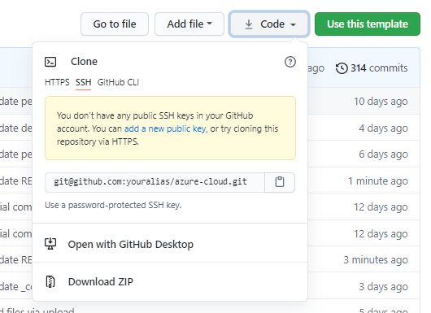
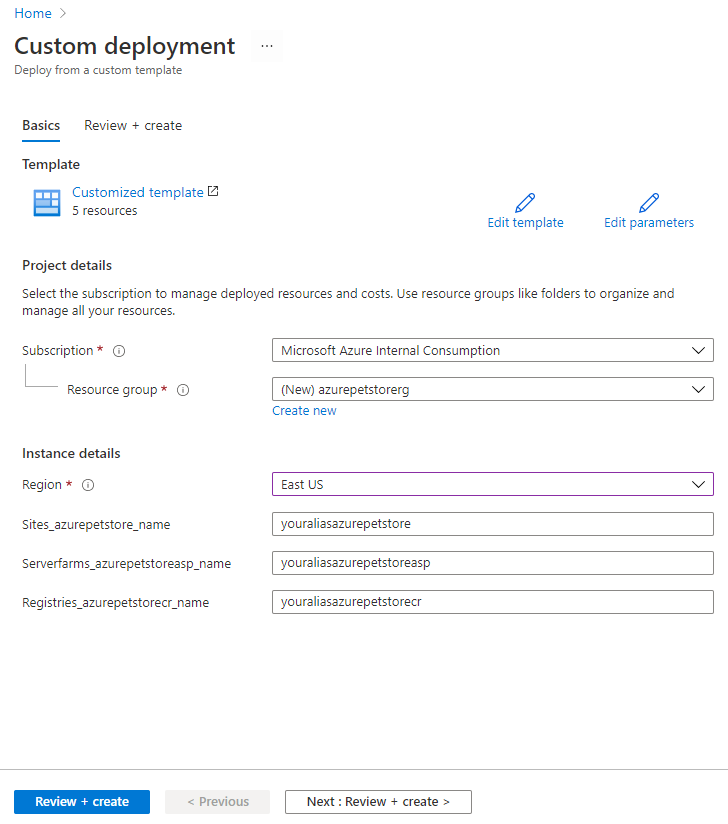

# 00 - Setup your environment

__This guide is part of the [Azure Pet Store App Dev Reference Guide](../README.md)__

In this section, we'll begin to set up your environment both for local development and for Azure.

> 📝 Please note, if you're not interested in building/deploying locally, you can certainly skip ahead and leverage Azure DevOps Pipelines and GitHub Actions to do the build & deploys for you. Once you complete the step of Deploying to Azure below (**Creating Azure Resources**), you can jump head to [03-configure-app-service-for-cd](../03-configure-app-service-for-cd/README.md)

---

## Forking the azure-cloud repository

Forking this repository is probably the easiest way to get started ensuring that you're able to make changes as needed while also easily fetching future changes as the become available. I also encourage pull requests for documentation change request(s), defect(s) and feature suggestions :)

Head to https://github.com/chtrembl/azure-cloud and select Fork in the top right

You should see something similar to the below image:


Clone this fork in your tool of choice (GitHub Dekstop or command line)

Either 



or

```
git clone git@github.com:youralias/azure-cloud.git
```

Make sure you have an SSH key defined within your GitHub Settings

```
ssh-keygen -t rsa -b 4096 -C "youremailaddress"
```

You should see somthing like the following (if you do not yet have a key, following the instructions and enter a pasphrase) 

```
ssh-keygen -t rsa -b 4096 -C "chtrembl@microsoft.com"
Generating public/private rsa key pair.
Enter file in which to save the key (C:\Users\chtrembl/.ssh/id_rsa):
Created directory 'C:\Users\chtrembl/.ssh'.
Enter passphrase (empty for no passphrase):
Enter same passphrase again:
Your identification has been saved in C:\Users\chtrembl/.ssh/id_rsa.
Your public key has been saved in C:\Users\chtrembl/.ssh/id_rsa.pub.
The key fingerprint is:
SHA256:RiO8...
```

If you are prompted with a warning that this key already exists, then cancel that task 'n' and move on to the next step

copy the contents of the key to your clipboard (using your path to your id_rsa.pub

```
more  C:\Users\chtrembl/.ssh/id_rsa.pub
```

## Creating Azure Resources

To save time, we have an ARM template to get a few Azure resources created:

 - App Service (Pet Store Application)
 - App Service Plan (Resources needed to host the Pet Store Application)
 - Container Registry (Used to store Docker Images for Pet Store Application and Pet Store Service)
 
> 📝 Please Note, Azure B2C, Azure Kubernetes Service, Azure Application Insights, API Management & Azure Key Vault will be setup in the subsequent guides.

Go ahead and Deploy to Azure

 [](https://portal.azure.com/#create/Microsoft.Template/uri/https%3A%2F%2Fraw.githubusercontent.com%2Fchtrembl%2Fazure-cloud%2Fmain%2Fpetstore%2F00-setup-your-environment%2Fazuredeploy.json)

> 📝 Please Note, Create a new resource when prompted, such as: **azurepetstorerg** and substitute your network alias for **youralias**, or something unique that will appear as a FQDM for accessing your Azure Pet Store Application.

You should see something similar to the below image:



> ⏱ The resource provisioning will take some time. **Do not wait!** Continue with the guides. Remember your Resource Group!

If you head over to your Azure Resource Group (once completed) You should see something similar to the below image:


> 📝 Please note, if your not interested in building/deploying locally, you can certainly skip ahead and leverage Azure DevOps Pipelines and GitHub Actions to do the build & deploys for you. Once you complete the first step of Deploying to Azure above, you can jump head to [03-configure-app-service-for-cd](../03-configure-app-service-for-cd/README.md)

## Prerequisites (Local Development Only)

Thus guide assumes you have Java JDK, Maven, Docker Desktop and Azure CLI installed on your machine. Until we setup your Azure Pipeline & GitHub Action, we will use Maven, Docker and Azure CLI, locally, to build and push both the PetStoreApp and PetStoreService Docker Images into Azure Container Registry. We will do other things like Administer our Azure Kubernetes Cluster.

 - Install Java JDK 13 or higher using the guide from the following https://examples.javacodegeeks.com/download-and-install-java-development-kit-jdk-13/

 - Install Maven using the following guide from https://maven.apache.org/guides/getting-started/maven-in-five-minutes.html
  
 - Install Docker Desktop from the following https://www.docker.com/products/docker-desktop and ensure you can run Docker from your command line.
 
 - Install Azure CLI from the following https://docs.microsoft.com/en-us/cli/azure/install-azure-cli-windows?tabs=azure-cli and ensure you can run AZ from your command line.


---

➡️ Next guide: [01 - Build the Docker Images](../01-build-the-docker-images/README.md)
