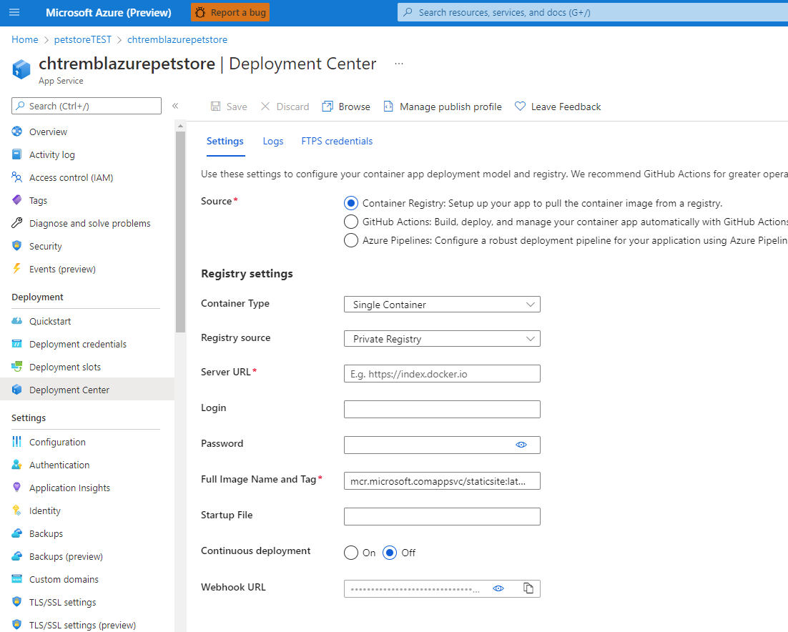
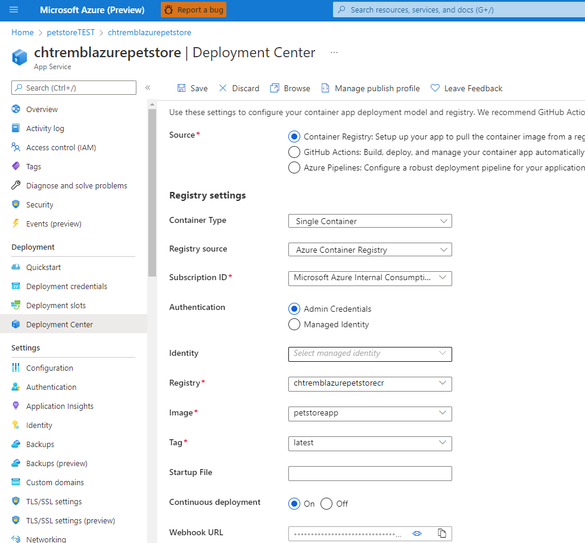

# 03 -Configure App Service for continuous deployment

__This guide is part of the [Azure Pet Store App Dev Reference Guide](../README.md)__

In this section, we'll configure App Service for continuous deployments of Azure Container Registry Docker image updates

> 📝 Please Note, We will assume you have forked the azure-cloud repository, it is the easiest way to get going (for instructions on this view the "**Forking the azure-cloud**" section in [00-setup-your-environment](../00-setup-your-environment/README.md). Also, both PetStoreApp and PetStoreService use a Spring Boot Application properties file named application.yml to drive the functionality/configuration of these applications which is located in src/main/resources/application.yml of both projects. By default, this file has all of the properties that are needed throughout the guides, and by default are commented out. This means that the applications will start automatically without having to configure anything. As you progress through the guides, each guide will inform you of what properties to uncomment and configure within your environment. If you have not already done so, login to your GitHub account, head to https://github.com/chtrembl/azure-cloud, and fork.

We are going to use Web Hooks to deploy the latest Azure Container Registry Docker image for *Pet Store App*.

> 📝 Please Note, *Pet Store Pet Service, Pet Store Product Service & Pet Store Order Service* will get deployed to Azure Kubernetes Service, we will tackle that in a subsequent guide.

Head to Azure Portal > App Services and find your App Service that was created in 00-setup-your-environment.

You should see something similar to the below image:

> 📝 Please Note, the URL listed is how we will be accessing our Pet Store App. If you visit that URL in a browser, you should see a generic App Service Page, deployed from a generic Azure Docker image. Keep this URL handy.

Select Deployment Center

You should see something similar to the below image:

> 📝 Please Note, this is the default configuration we are going to change this up. Change Image Source to Azure Container Registry, Find your Pet Store Image Name and Tag and Select On for Continuous Deployment. Make sure to click Save. (If you didn't complete 01-build-the-docker-images and 02-push-the-docker-images-to-acr which were for Local Development, then you probably do not have any Docker Images in your Container Registry yet and will need to move ahead now to Next guide: [04 - Configure Git Hub Action for CI/CD into App Service](../04-configure-git-hub-action-for-ci-cd-into-app-service/README.md) It's ok, you will do the steps below, again, either way, in the next guide)

You should see something similar to the below image:

Once you update this form with your meta data, select Save. Head back to the Overview page and click "Restart" to cycle your container.

> 📝 Please Note, you will notice the logs within this view as well, notice the Docker commands being executes just as they were when you did this locally. It's the same behavior. Docker pulls the latest image and then runs it injecting the configuration settings that are specified.

Open a browser and head to your URL from above

> 📝 Please Note, you won't yet be able to communicate with any of the services since they are not yet deployed anywhere. You will get HTTP errors if/when you try to visit Pet Breeds or Pet Product pages.

You should see something similar to the below image:

🎉Congratulations, you now have Pet Store App Continuously Deploying into your App Service each and every time an image is pushed to Azure Container Registry.

Things you can now do now with this guide

☑️ App Service Configuration, understanding how App Service gets configured

---
➡️ Next guide: [04 - Configure Git Hub Action for CI/CD into App Service](../04-configure-git-hub-action-for-ci-cd-into-app-service/README.md)
