# 11 - Configure Azure DevOps Pipeline for CI/CD into Azure Databricks

__This guide is part of the [Azure Pet Store App Dev Reference Guide](../README.md)__

In this section, we'll configure Azure DevOps Pipeline for CI/CD into Azure Databricks

> 📝 Please Note, We will assume you have forked the azure-cloud repository, it is the easiest way to get going (for instructions on this view the "**Forking the azure-cloud**" section in [00-setup-your-environment](../00-setup-your-environment/README.md). Also, both PetStoreApp and PetStoreService use a Spring Boot Application properties file named application.yml to drive the functionality/configuration of these applications which is located in src/main/resources/application.yml of both projects. By default, this file has all of the properties that are needed throughout the guides, and by default are commented out. This means that the applications will start automatically without having to configure anything. As you progress through the guides, each guide will inform you of what properties to uncomment and configure within your environment. If you have not already done so, login to your GitHub account, head to https://github.com/chtrembl/azure-cloud, and fork.

Suppose your Data team is collaborating in DataBricks notebook(s) (or in any data service/technology for that matter) and would like the ability to source/peer review these notebook changes, have an audit trail/revision history and continuously deploy them to specific environment(s). 

This guide will walk through the steps needed to apply typical DevOps practices in a DataOps scenario.

And what is DataOps again? From Wiki: DataOps is an automated, process-oriented methodology, used by analytic and data teams, to improve the quality and reduce the cycle time of data analytics. While DataOps began as a set of best practices, it has now matured to become a new and independent approach to data analytics

Lets walk through the steps needed to perform GitHub Trunk based Development, for Python Notebooks, and leverage Azure DevOps Pipelines for Continuous Integration and Deployment into Azure Databricks. We will be be building a Python Notebook that loads PetStore Dog Breed Data and queries/analyzes it. 

> 📝 Please Note, The objective isn't to dive deep into Databricks/Notebooks but rather leverage basic notebook functionality to show the potential with DataOps practices that can be applied within your organization/team/uses cases to work and collaborate more efficiently.

You should see something similar to the below image:

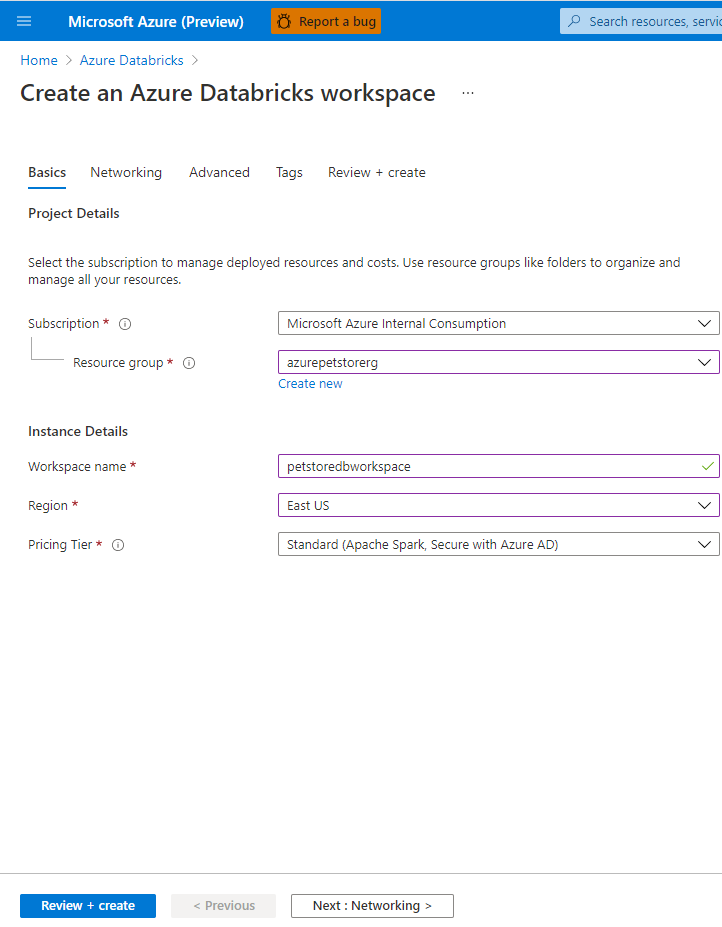

You should see something similar to the below image:

You should see something similar to the below image:

You should see something similar to the below image:

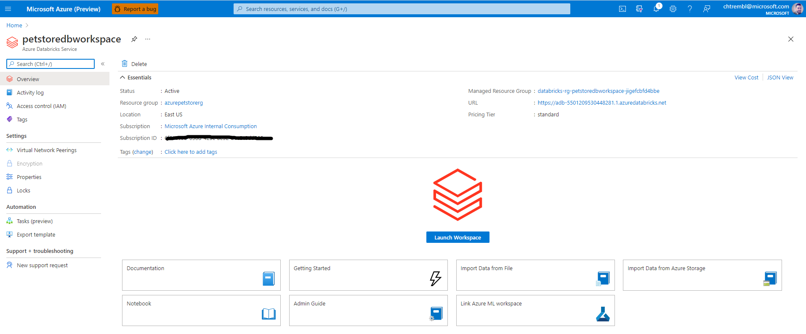

You should see something similar to the below image:

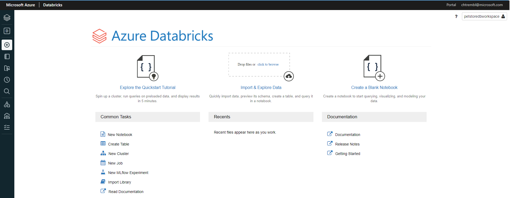

You should see something similar to the below image:

You should see something similar to the below image:

You should see something similar to the below image:

You should see something similar to the below image:

You should see something similar to the below image:

You should see something similar to the below image:

You should see something similar to the below image:

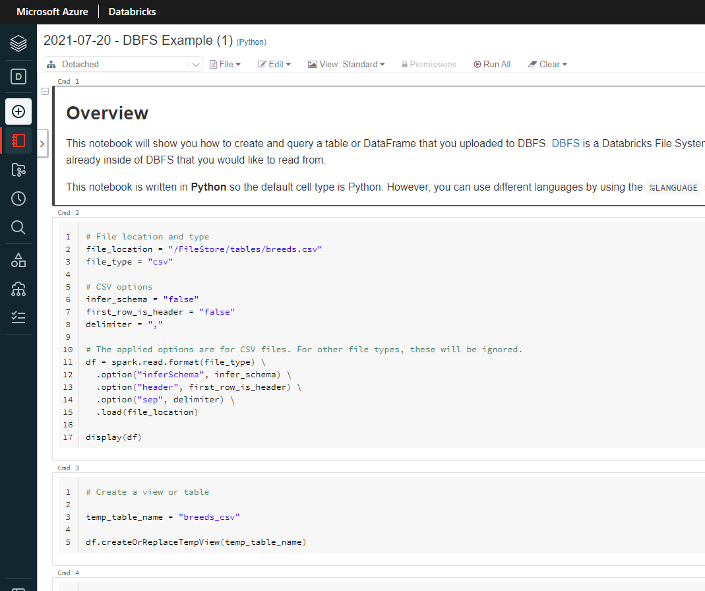

You should see something similar to the below image:

You should see something similar to the below image:

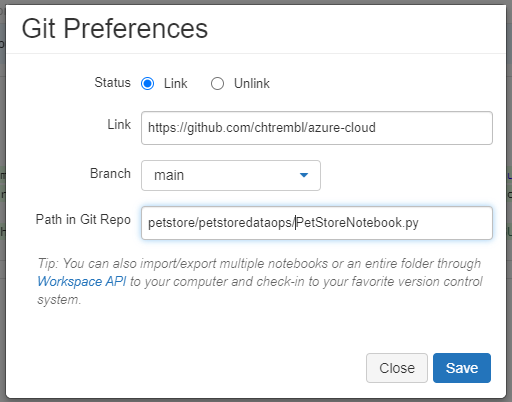

You should see something similar to the below image:

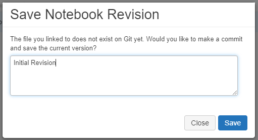

You should see something similar to the below image:

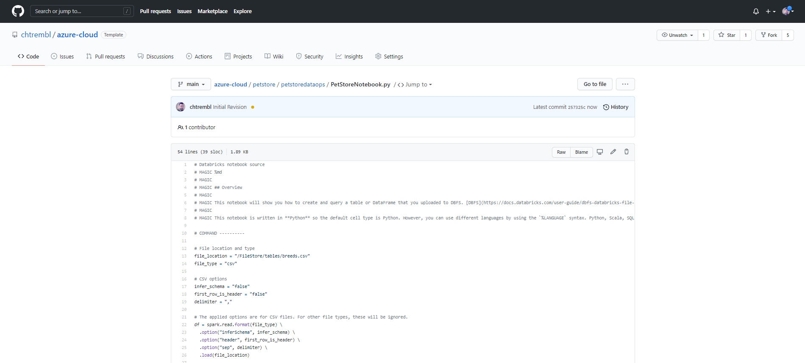

You should see something similar to the below image:

You should see something similar to the below image:

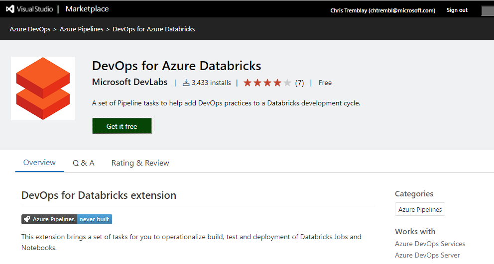

You should see something similar to the below image:

You should see something similar to the below image:

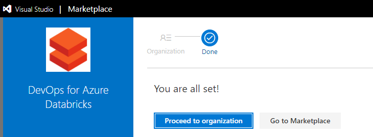

You should see something similar to the below image:

You should see something similar to the below image:

You should see something similar to the below image:

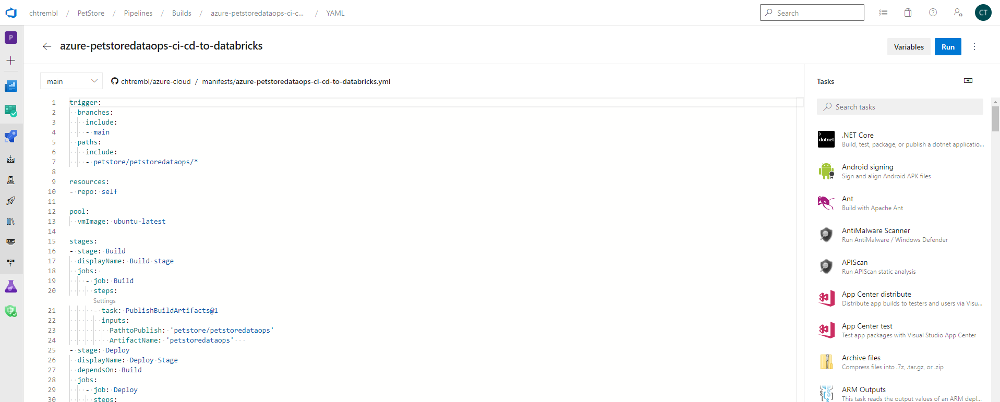

You should see something similar to the below image:

You should see something similar to the below image:

You should see something similar to the below image:

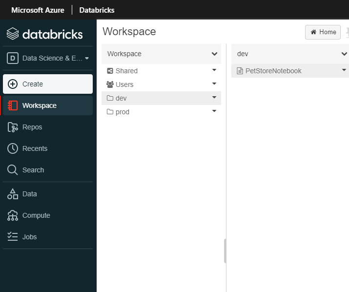

You should see something similar to the below image:

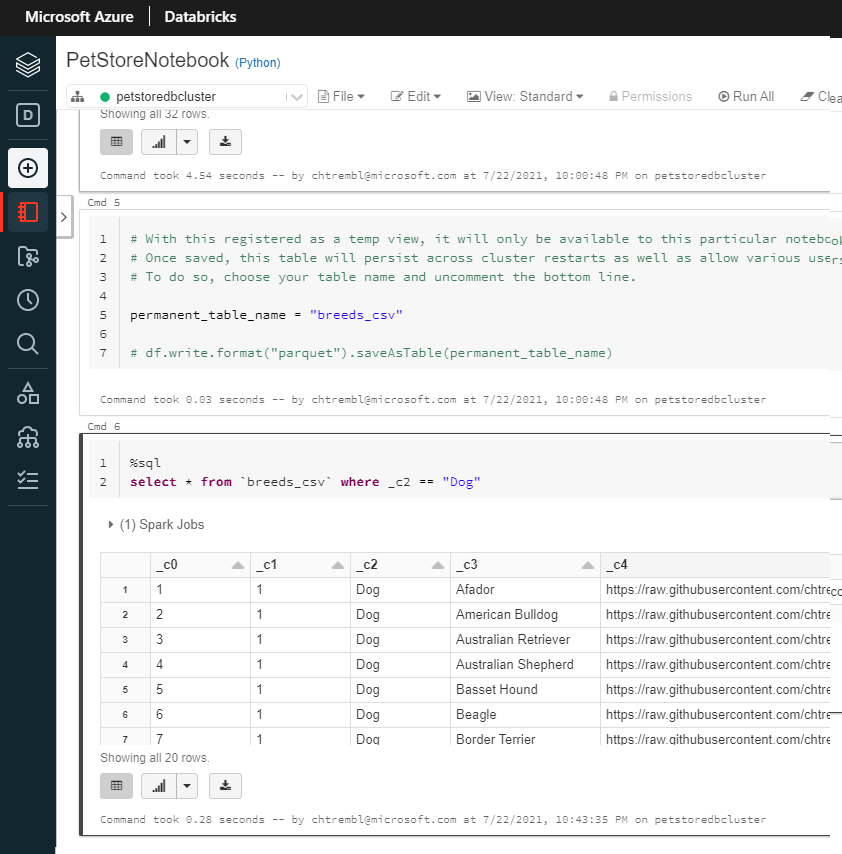

You should see something similar to the below image:

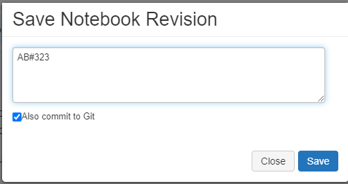

You should see something similar to the below image:

You should see something similar to the below image:

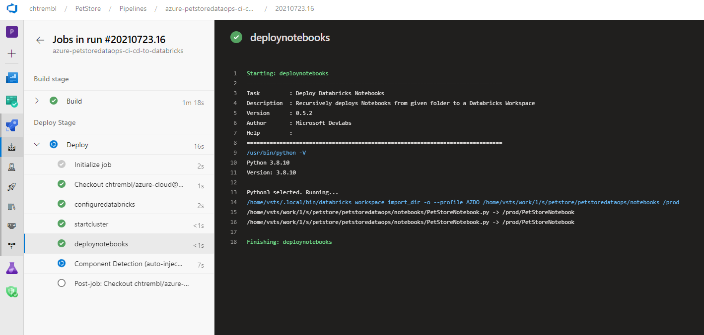

You should see something similar to the below image:

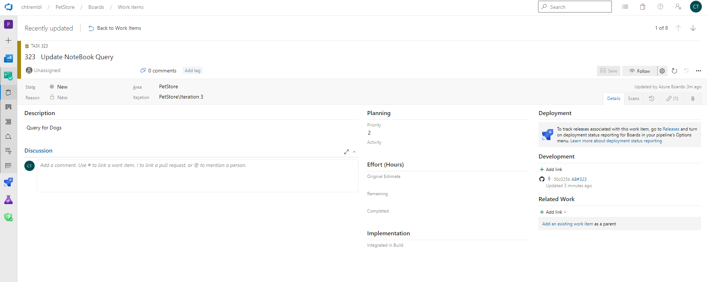

You should see something similar to the below image:

You should see something similar to the below image:

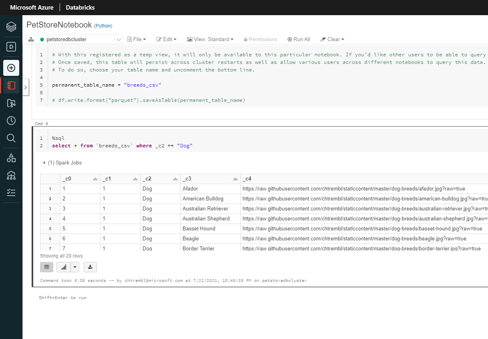

Things you can now do now with this guide

☑️ An understanding pf DataOps concepts

☑️ An understanding pf implementing CD/CD into DataBricks
