# 11 - Configure Azure DevOps Pipeline for CI/CD into Azure Databricks

__This guide is part of the [Azure Pet Store App Dev Reference Guide](../README.md)__

In this section, we'll configure Azure DevOps Pipeline for CI/CD into Azure Databricks

> 📝 Please Note, We will assume you have forked the azure-cloud repository, it is the easiest way to get going (for instructions on this view the "**Forking the azure-cloud**" section in [00-setup-your-environment](../00-setup-your-environment/README.md). Also, both PetStoreApp and PetStoreService use a Spring Boot Application properties file named application.yml to drive the functionality/configuration of these applications which is located in src/main/resources/application.yml of both projects. By default, this file has all of the properties that are needed throughout the guides, and by default are commented out. This means that the applications will start automatically without having to configure anything. As you progress through the guides, each guide will inform you of what properties to uncomment and configure within your environment. If you have not already done so, login to your GitHub account, head to https://github.com/chtrembl/azure-cloud, and fork.

Suppose your Data team is collaborating in Databricks notebook(s) (or in any data service/technology for that matter) and would like the ability to source/peer review these notebook changes, have an audit trail/revision history and continuously deploy them to specific environment(s). 

This guide will walk through the steps needed to apply typical DevOps practices in a DataOps scenario.

**And what is DataOps again? From Wiki: DataOps is an automated, process-oriented methodology, used by analytic and data teams, to improve the quality and reduce the cycle time of data analytics. While DataOps began as a set of best practices, it has now matured to become a new and independent approach to data analytics**

This guide will walk through the steps needed to perform GitHub Trunk based Data Development for Python Notebooks and leverage Azure DevOps Boards and Pipelines for Continuous Integration and Deployment into Azure Databricks. We will be be building a Python Notebook that loads PetStore Dog Breed Data and queries/analyzes it. 

> 📝 Please Note, The objective isn't to dive deep into Databricks/Notebooks but rather leverage basic notebook functionality to show the value of  DataOps practices and how they can be applied within your organization/team/uses cases to work and collaborate more efficiently.

 **Things we will do in this guide**
 
 - Setup/Configure Databricks
 - Setup Configure DevOps Boards Item & Pipeline
 - Setup GitHub Action
 - Collaborate efficiently

Lets head over to Azure Portal and create an Azure Databricks workspace. We will use this workspace to build/run our Python notebook for which we ultimately want to deploy into multiple regions. (Think Dev Region, Prod Region etc...)

Select your subscription, resource group, region and pricing tier and give your workspace a name.

You should see something similar to the below image:


Select Review & Create (This may take some time)

You should see something similar to the below image:

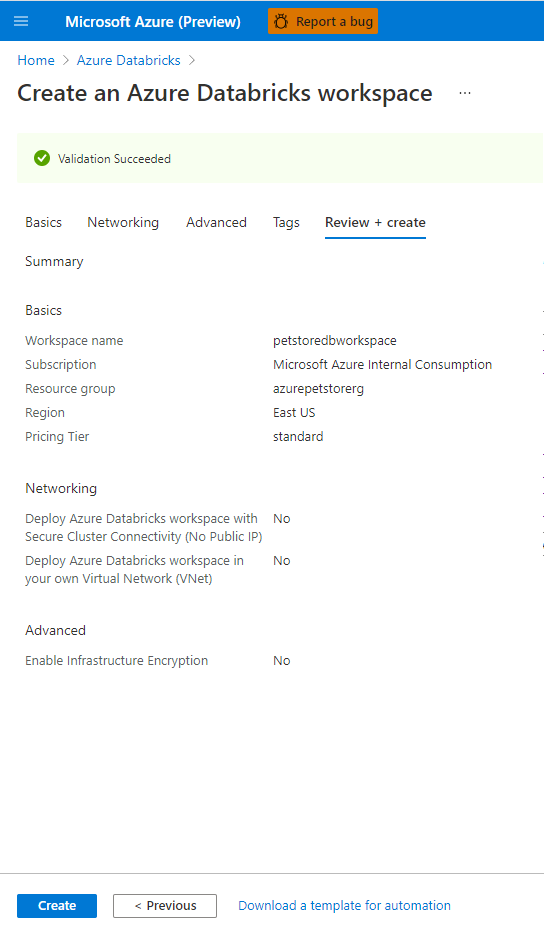

Deployment of resources will occur.

You should see something similar to the below image:


Once complete you will be taken to the landing page for this Azure Databricks resource. 

> 📝 Please Note, you will need the URL (located in the essentials section) later in this guide

You should see something similar to the below image:


Select "Launch Workspace" which will open a tab into Databricks.

You should see something similar to the below image:


Select "New Cluster" which will prompt us to configure the compute resources where we will ultimately run our Python Notebook. Give it a cluster name and select the remaining defaults as seen below and select "Create Cluster".

You should see something similar to the below image:

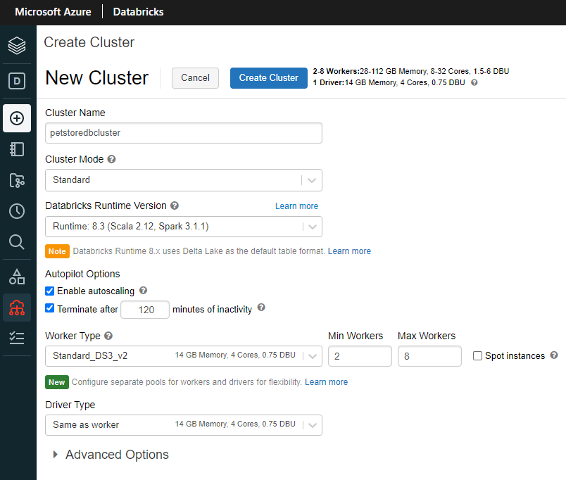

Once complete you will be take to the configuration tab of your cluster where various administration tasks can be performed.

You should see something similar to the below image:

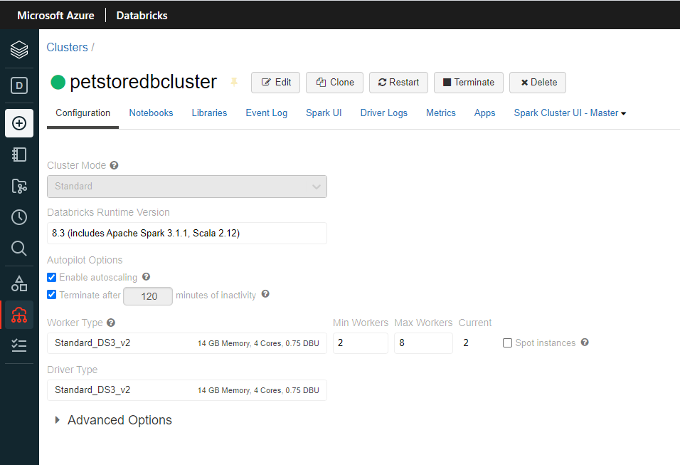

From the left navigation, let's go ahead and create two folders, one called "dev" and one called "prod". 

> 📝 Please Note,  typically development/testing is done in one environment and continuously integrated/deployed into N other environments (and in most cases, access restricted environments, usually different compute instances all together such as diff app servers and/or compute farms etc...) For the sake of this guide, we are "simulating" this behavior with "folders" within one Databricks workspace. We will be continuously integrating/deploying dev to prod, in a productionalized use case, you may continuously/integrate from a dev cluster to a prod cluster etc....
 
You should see something similar to the below image:

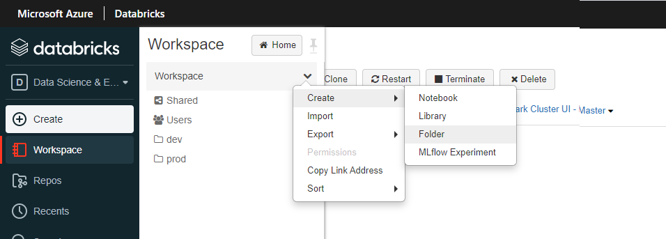

Create a new notebook in the dev Folder.

You should see something similar to the below image:

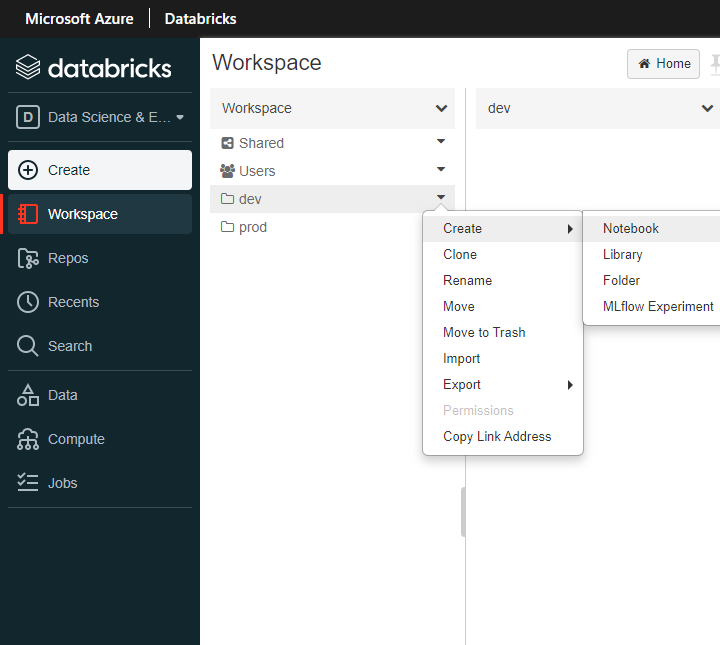

Give the notebook a name, language (Python) and cluster (select the cluster you previously created) and select create.

You should see something similar to the below image:

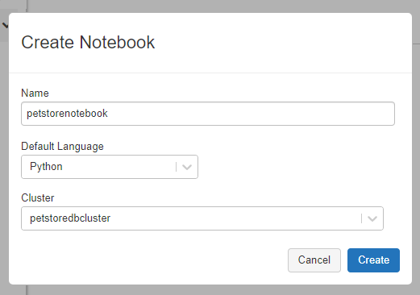

Now add some data that we can load and analyze with our Python notebook code. Drag/Drop the [breeds.csv](https://github.com/chtrembl/azure-cloud/blob/main/petstore/petstoredataops/breeds.csv) into Files and click "Create Table with UI". This will give us the Python scaffolding/boiler plate code needed to load/process the csv data.

> 📝 Please Note, this is ultimately the code that we will be applying DataOps practices to. (Version Control, peer collaboration, testing, CI/CD etc...)

You should see something similar to the below image:

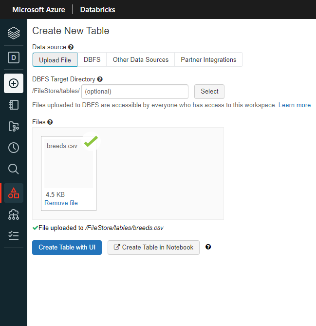

Once created you will get a notebook that has been generated automagically for you.

You should see something similar to the below image:


In the top right, click "Revision history" and click "Git: Not linked" to link up Git Hub and add this notebook to GitHub.
You should see something similar to the below image:

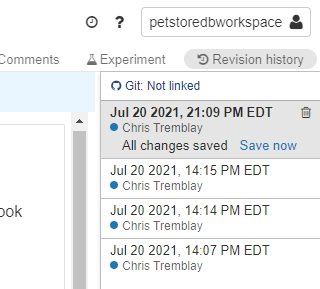

Add your GitHub Repo Link, Branch and Path to where this Python notebook should reside and click "Save".

You should see something similar to the below image:


Give it a commit message and click "Save".

You should see something similar to the below image:


If you head to GitHub and browse your repository you should see the newly committed Python notebook of code. 

> 📝 Please Note, we now have our Python notebook in Git Hub source control and will be able to start benefiting from collaboration features.

You should see something similar to the below image:


Back in Databricks, locate your name in the top right, click that and under "User Settings", lets go ahead and click "Generate New Token" 

> 📝 Please Note, our Azure DevOps pipeline will need this token to successfully authenticate/deploy our notebook to the prod workspace folder

You should see something similar to the below image:

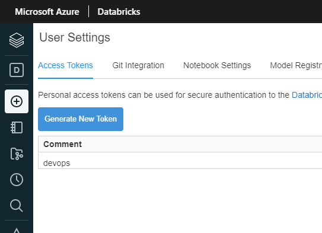

Give it a comment and lifetime (expiration) and click "Generate". 

> 📝 Please Note, make note of this token, you won't be able to access it again from this point on.

Now let's get Azure DevOps configured properly. Head to Azure DevOps Marketplace and search for "databricks".

> 📝 Please Note, our pipeline will be leveraging the Databricks tasks to facilitate our connection/deployment into Databricks from Azure DevOps & GitHub.

You should see something similar to the below image:

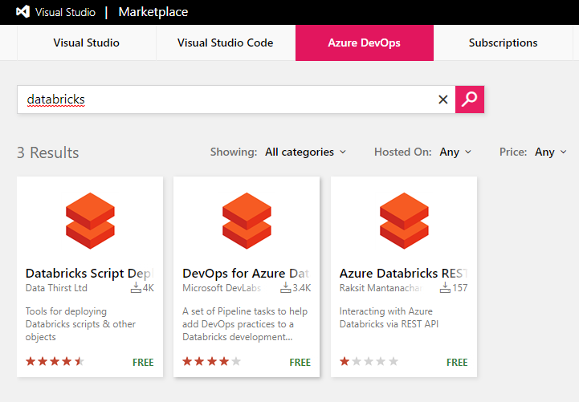

Install the Azure DevOps for Azure Databricks tasks.

You should see something similar to the below image:


Select your organization and click "Install".

You should see something similar to the below image:

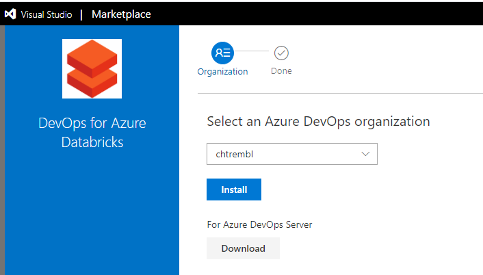

Click "Proceed to organization"

You should see something similar to the below image:


Create a new Azure DevOps Pipeline. You can paste in the contents of mine located here [azure-petstoredataops-ci-cd-to-databricks.yml](https://github.com/chtrembl/azure-cloud/blob/main/manifests/azure-petstoredataops-ci-cd-to-databricks.yml)

> 📝 Please Note, this pipeline is designed to trigger on any changes to petstore/petstoredataops/* (any changes we make to the notebook in Databricks and/or wherever the notebook is being managed. There are two stages in this pipeline: Build and Deploy. The build stage creates the notebook artifacts from GitHub. Typically this is a compilation stage in typical DevOps practices where source code is being compiled, however that is not the case with our Python notebook. The Deploy stage, depends on Build, and the objective here is to connect to Databricks and deploy the artifacts (notebook) from the Build stage. We will rely on the Azure DevOps Databricks task to do the heavy lifting for us. Make sure you update your yaml with your Databricks URL and your Cluster ID (Details on how to find that below). You will also need to inject the token (secret) that we previously generated. You can also add more stages, perhaps you'll have a testing stage to ensure things are behaving as expected by running some automated unit tests etc... For this guide however we have simplified to just Build/Deploy from dev to prod.

```yml
trigger:
  branches:
    include:
    - main
  paths:
    include:
    - petstore/petstoredataops/*

resources:
- repo: self

pool:
  vmImage: ubuntu-latest

stages:
- stage: Build
  displayName: Build stage
  jobs: 
    - job: Build
      steps:
      - task: PublishBuildArtifacts@1
        inputs:
          PathtoPublish: 'petstore/petstoredataops'
          ArtifactName: 'petstoredataops'   
- stage: Deploy
  displayName: Deploy Stage
  dependsOn: Build
  jobs:
    - job: Deploy
      steps:
      - task: configuredatabricks@0
        inputs:
          url: 'https://adb-5501209530448281.1.azuredatabricks.net'
          token: $(token)
      - task: startcluster@0
        inputs:
          clusterid: '0720-145135-coup132'          
      - task: deploynotebooks@0
        inputs:
          notebooksFolderPath: '$(System.DefaultWorkingDirectory)/petstore/petstoredataops/notebooks'
          workspaceFolder: '/prod'

```
You should see something similar to the below image:


Add a new pipeline variable/secret and paste in your Databricks token value. 

You should see something similar to the below image:


Get your Databricks ClusterId from the cluster "Tags" view under "Advanced Options"

You should see something similar to the below image:

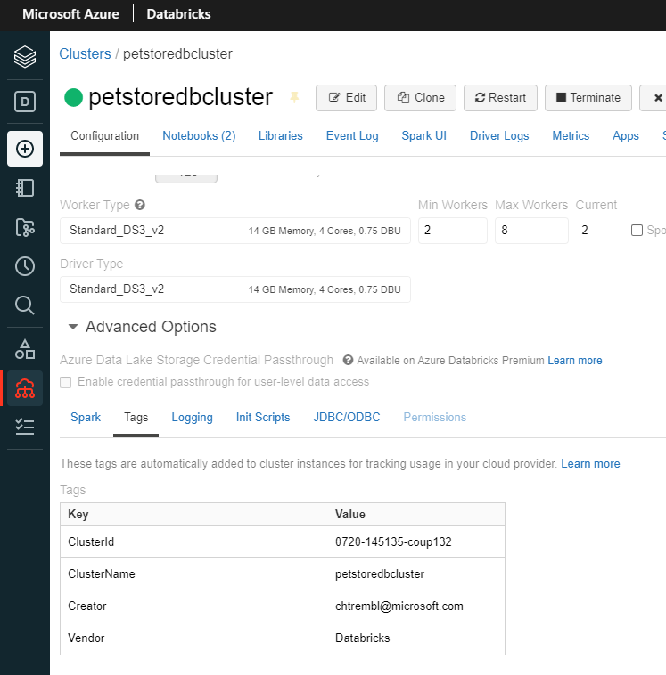

Head over to Azure DevOps Boards and create a new Work Item Task (that will allow us to track our development efforts from a project management standpoint, in this case I have a work item to track the development of writing a new query that is breed specific)

> 📝 Please Note, make note of your Work Item ID.

You should see something similar to the below image:

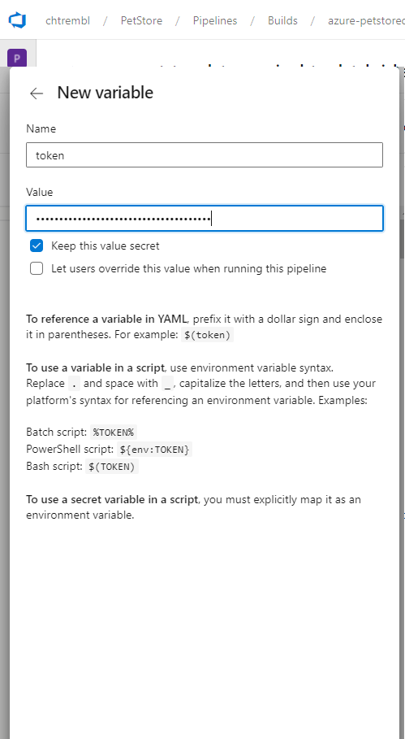

Back in the Databricks **dev** workspace folder, make a change to the notebook.  Add a query to select a specific breed. 

You should see something similar to the below image:

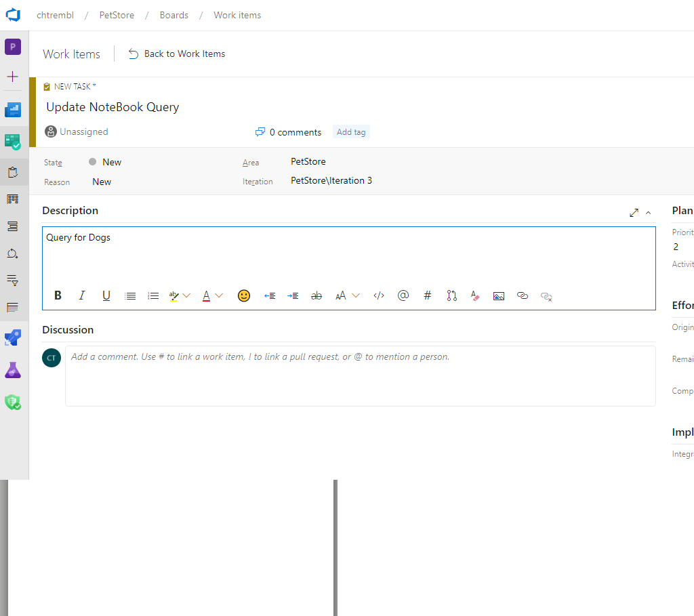

Save this Notebook Revision with the commit message and prefix it with "AB#ID" where id is the Azure DevOps Work Item. 

> 📝 Please Note, this is how GitHub will sync back with Azure DevOps and allow us to track our development efforts from a project management standpoint.
> 
You should see something similar to the below image:


Once committed, the Azure DevOps pipeline will automagically execute and upon success will deploy into the Databricks **prod** workspace folder

You should see something similar to the below image:


You should see something similar to the below image:


You should see something similar to the below image:


You should see something similar to the below image:


You should see something similar to the below image:


You should see something similar to the below image:

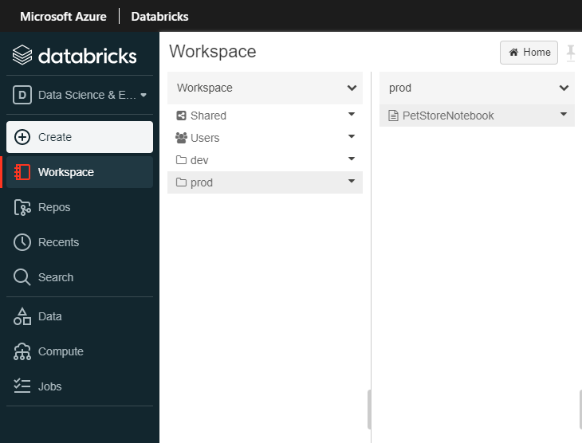

You should see something similar to the below image:


Things you can now do now with this guide

☑️ An understanding pf DataOps concepts

☑️ An understanding pf implementing CD/CD into DataBricks
