# 14 - Build a Power App that uses a Custom Connector to Pull Data

__This guide is part of the [Azure Pet Store App Dev Reference Guide](../README.md)__

In this section we'll look at how to develop an a Power App that consumes data from the Azure Function App that was built in the previous guide.

> 📝 **Please Note, we assume you have completed the [Configure Apps to use Application Insights](../08-configure-apps-to-use-application-insights/README.md) guide and have a working Application Insights service that can be used by this Azure Function App.**

> 📝 **Please Note, we assume you have completed the [Build and Deploy Azure Functions](../13-build-deploy-azure-functions/README.md) guide and have a working Azure Function App that retrieves petStoreCurrentSessionTelemetry.**

Head over to https://powerapps.microsoft.com/ and sign in and selct the Home icon from the left navigation.

You should see the following:
  
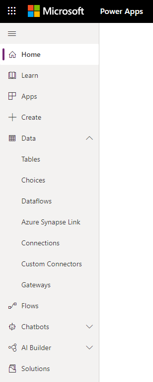

Before we create our Power App Canvas App, we are going to configure our Custom Data Connector. (It is possible to create the connectors at any point in time, for the sake of this guide, I decided to get the data integration implemented first)

Select Custom Connectors and then Select New custom connector (Create from blank)

You should see the following:
  
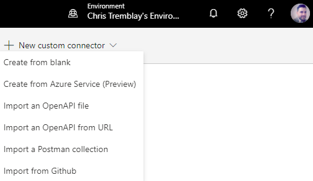

Give your Connector a name *(I'm using "Azure Pet Store Functions", this is the name of your app and how it will appear to your users.)* And select "Continue"

You should see the following:
  

Let's define all of the Meta-Data for our Custom Connector. (You can also import a Swagger definition if you already have one). Fill out the **1. General** tab here. I'm keeping the defaults and entering my function app url endpoint domain and the base url.

You should see the following:
  

Fill out the **2. Security** tab here. We won't be applying anything for now, keep the defaults of no authentication.

You should see the following:
  

Fill out the **3. Definition** tab here. This is where we can define all of our Custom Connector operations. These are the mappings to our Azure Function App HTTP Triggers, think of this as a proxy to our Azure Function App, proxies to your HTTP endpoints (GET's POST's etc...). Fill out the Summary, Description and Operation ID. Operation ID is the important one here. This is how we will invoke our Custom Connector Operation from the Power App we build shortly.

Select Request to define our incoming GET Request Payload. Our Azure Function App has an HTTP Trigger on GET Request(s) that expects an apiKey an minsAgo query string parameters, so we will define those here. Select the HTTP Verb "GET" and paste in your Azure Function App operation and query string. The Custom Connector will automagically interpret this for us and generate a dynamic payload for us to work off of. Click import.

You should see the following:

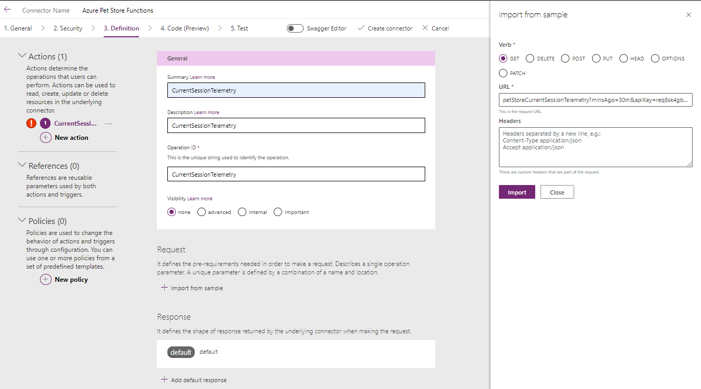
  
Select the minsAgo Request Parameter button to edit this properties of this incoming Request Parameter. This allows us to specify default values, useful for scenarios where our Power App does not need to consistently pass these Request Parameters (static vs dynamic, perhaps when the App Loads you want to pull data but then allow user's to customize and change the values)

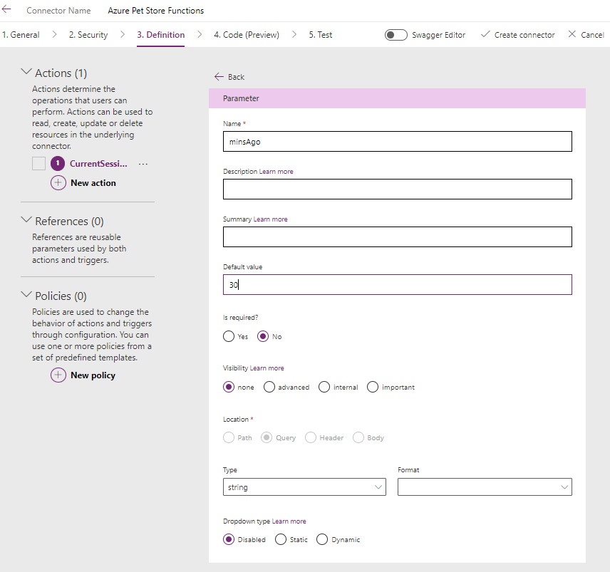

Select the apiKey Request Parameter button to edit this properties of this incoming Request Parameter. You can paste in your apiKey value here (if your expecting in your Azure Function App)

You should see the following:
  

You should see the following:
  
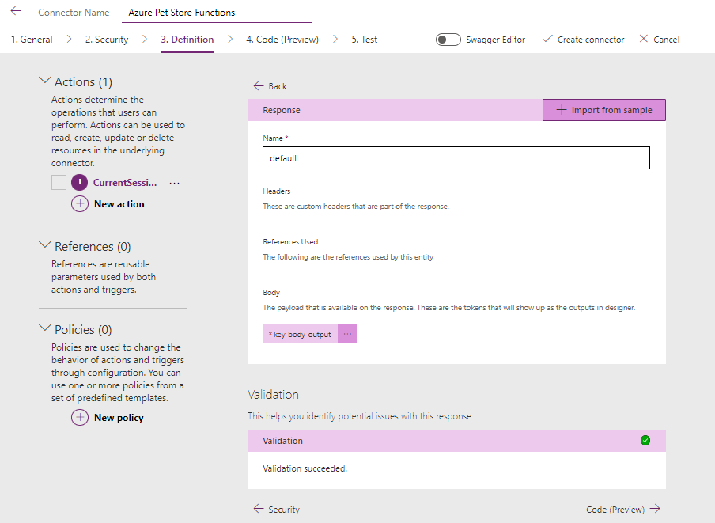

You should see the following:
  
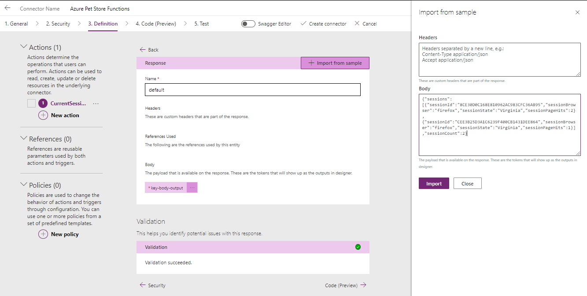

You should see the following:
  

You should see the following:
  

You should see the following:
  

You should see the following:
  

You should see the following:
  
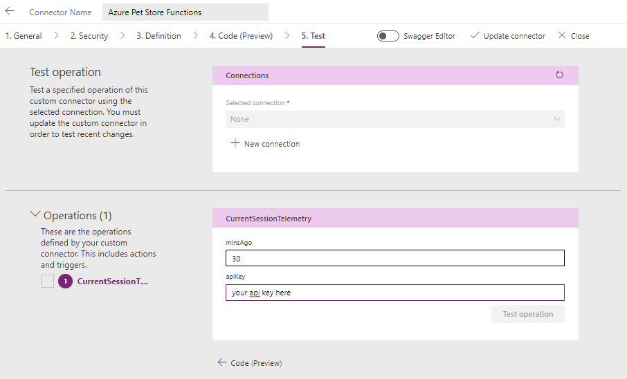

You should see the following:
  

You should see the following:
  

You should see the following:
  

You should see the following:
  
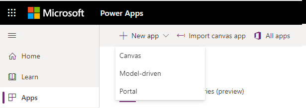

You should see the following:
  
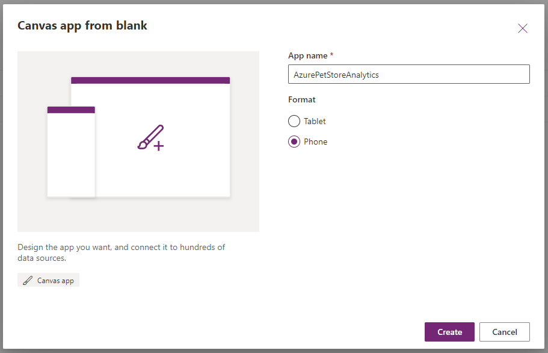

You should see the following:
  

You should see the following:
  
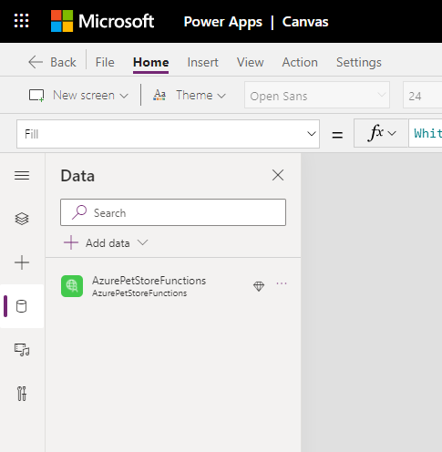

You should see the following:
  

You should see the following:
  

You should see the following:
  
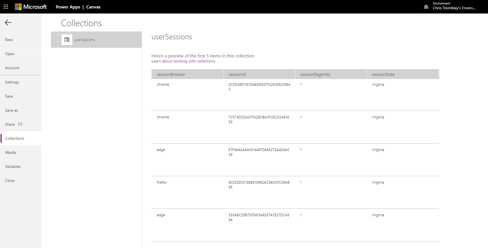

You should see the following:
  

You should see the following:
  

You should see the following:
  

You should see the following:
  
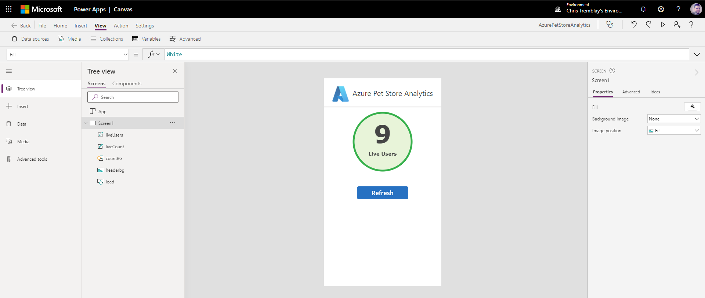

You should see the following:
  

You should see the following:
  
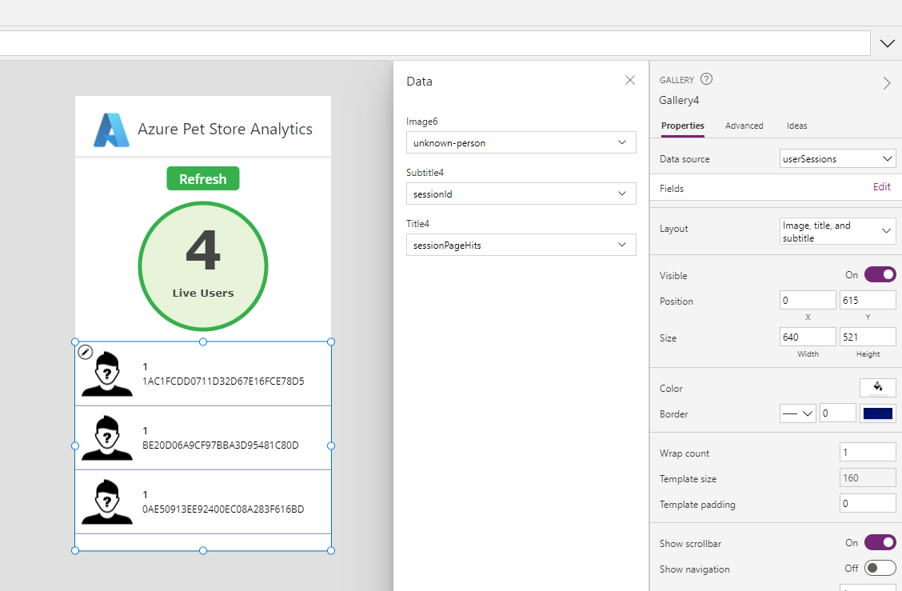

You should see the following:
  
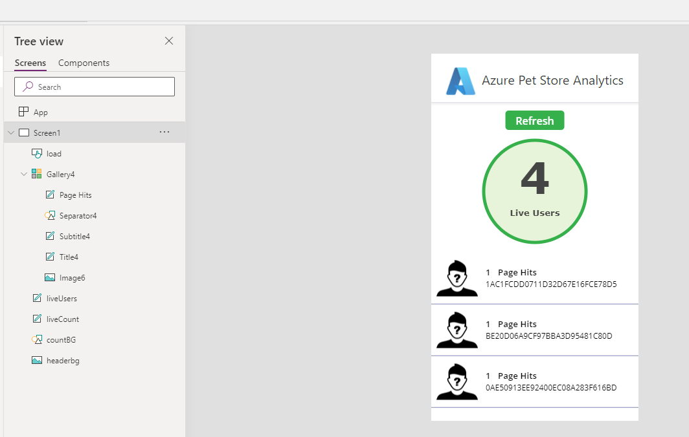

You should see the following:
  
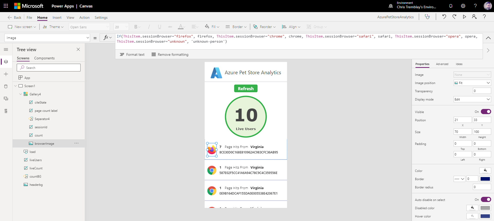

You should see the following:
  

Things you can now do now with this guide

☑️ Build a Power App with Custom Connectors
